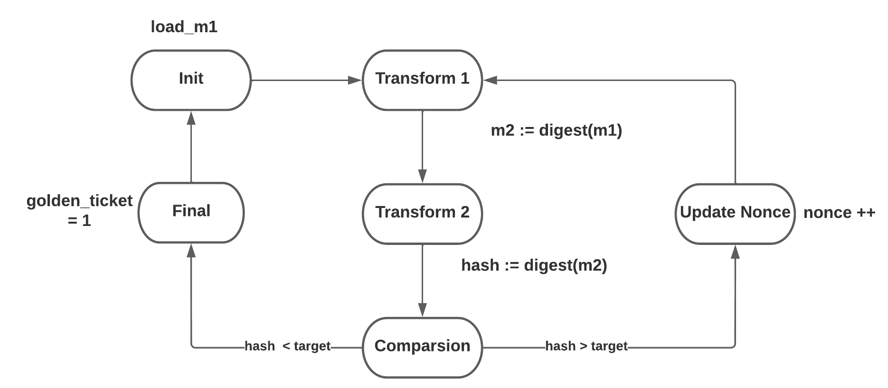

# RTL Design for a bitcoin miner

## Introduction
This project was developed as part of a digital circuits class, the goal was to provide a register-transfer level design for an application of our choice. Given the popularity of cryptocurrencies, it seemed to be an interesting challenge to design our own bitcoin miner. 
## Bitcoin
The validation of bitcoin transactions is done by computational work. For a block to be validated, its header must be fed to a hash function(sha-256) and the result must be compared to a target value. If the comparison succeeds, a 4 byte part of the header called nonce is returned. Otherwise, the nonce is updated and a new attempt is made.   
## Design Considerations
The first step was to decide what tasks the circuit should perform. In order to mine bitcoins, an 80 bytes(640 bits) block must be hashed by the sha-256 function, that works by processing 512 bits blocks at a time. Hence, two blocks must be hashed, the first block hash remains constant, while the second block hash changes after each nonce update.
Thus, we decided that our circuit would only perform the hash of the second block, this allows for a simpler design while maintaining most of the computational work to be executed by the miner. 

We made use the following steps:
1. Creation of a high-level state machine
2. Definition of the datapath
3. Creation of a finite-state machine
4. Controller design 
5. VHDL implementation
6. Controller simulation

## High level state machine
We start by modeling the miner with a high-level state machine. The circuit receives as inputs the second block message(m1), the target and the hashed first block(m0). Two hash transforms are made, as required by the bitcoin protocol, and the resulting hash is compared with the target. In the case where hash < target, the transaction block was successufuly validated and we are done, otherwise the nonce is updated and another iteration is needed.  

## Datapath
From the high-level state machine, it is possible to project an adequate datapath. The hash computations are performed by two 'digest' modules, whose inputs are controlled by multiplexers. Two sets of 16 32-bits registers store the 512 bits blocks and two sets of 8 32-bits registers(reg_init_0 and reg_init_1) store the initial hash variables. The registers 'Reg_hash' receive the hashed messages. 

A 64-bit counter keeps track of the sha-256 current iteration, the 'cmp_16' comparator is responsible for the scheduling process and the 'cmp_target' comparator validates the produced hash. An 32 bit adder is responsible for the nonce update and a ROM stores the constants required by the digest module. To better understand the proposed datapath, one must know how the sha-256 computation works. The 'digest' module's operation has been abstracted.

## Finite-state machine
After the datapath definition, we must transform the high-level state machine to a finite-state machine. Each transform stage has been expanded into 4 states and the final fsm has 12 states. 

State 1. Initiate variables

State 2. Initiate first hash

States 3 - 5. Perform first hash 

State 6. Initiate second hash

States 7 - 9. Perform second hash

State 10. Compare hash with target 

State 11. Update nonce

State 12. Hash found

## Controller Design

From the finite-state machine we coded the states and we assembled a truth table. Then, a logical equation was extracted for each one of the 20 outputs and the combinational circuit of our controller was projected. 

 

Since there are 12 states, a 4 bit register was used as a state register. 

